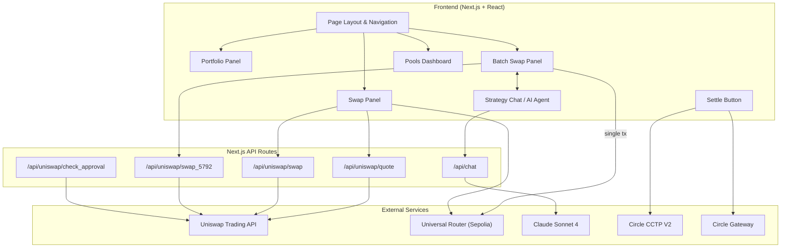
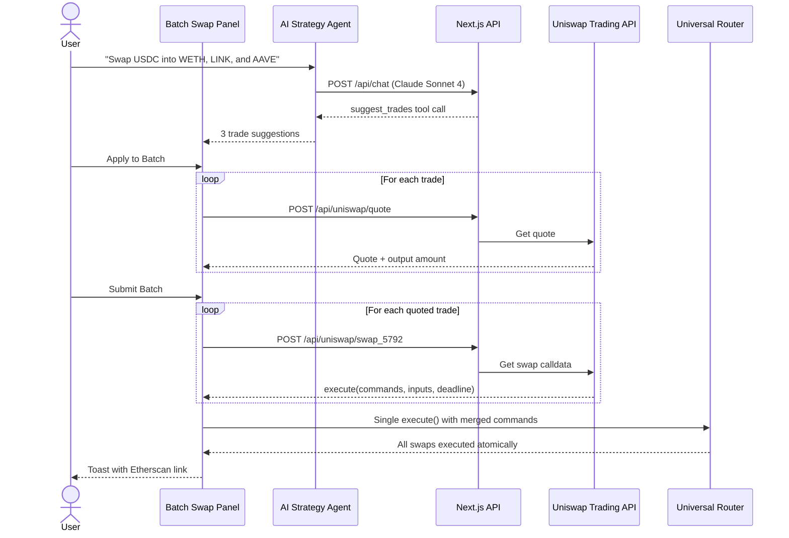
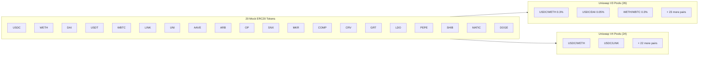
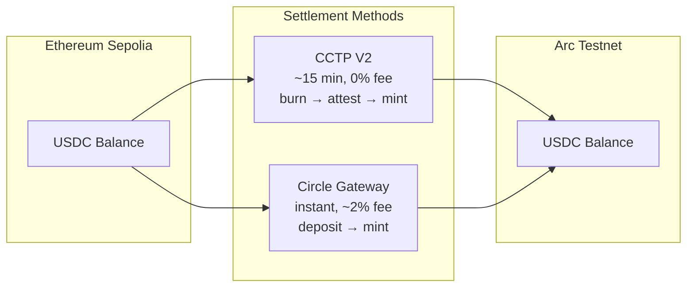

# Tranquille

A batch swap DeFi application on Ethereum Sepolia that lets users execute multiple token swaps in a single atomic transaction, powered by an AI strategy agent and Uniswap V3/V4.

## Problem

Rebalancing a DeFi portfolio today means executing swaps one at a time — each requiring a separate approval, signature, and on-chain transaction. For a 5-token rebalance, that's 10+ transactions, each with gas costs, slippage windows, and execution risk. Price can move between your first and last swap.

## Solution

Tranquille batches multiple swaps into a **single Universal Router transaction** via EIP-5792. An AI agent interprets natural language strategies ("rotate 50% of my stablecoins into blue chips") and generates concrete trade configurations. Users review, quote, and submit — one click, one transaction, atomic execution.

## Architecture



## Batch Swap Flow



## Token & Pool Architecture



## Cross-Chain Settlement



## Features

- **Batch Swaps** — Multiple swaps merged into one Universal Router `execute()` call
- **AI Strategy Agent** — Claude Sonnet 4 generates trade suggestions from natural language
- **Portfolio Dashboard** — Real-time balances with asset allocation donut chart
- **Pools Browser** — View all V3/V4 pools with liquidity metrics
- **Single Swaps** — Traditional swap UI with EIP-712 permit support
- **Cross-Chain Settlement** — USDC transfers to Arc via CCTP V2 or Circle Gateway
- **Toast Notifications** — Transaction confirmations with Etherscan links

## Tech Stack

| Layer | Technology |
|-------|-----------|
| Framework | Next.js 16, React 19, TypeScript |
| Styling | Tailwind CSS 4 |
| Web3 | Wagmi 2, Viem 2, RainbowKit |
| DEX | Uniswap V3/V4 via Trading API |
| AI | Claude Sonnet 4 (Anthropic SDK) |
| Cross-chain | Circle CCTP V2, Circle Gateway |
| Tokens | 20 custom ERC20s on Sepolia |

## Project Structure

```
app/
├── src/
│   ├── app/
│   │   ├── page.tsx                    # Main layout with sidebar navigation
│   │   ├── layout.tsx                  # Root layout, fonts, providers
│   │   └── api/
│   │       ├── uniswap/               # Proxy routes to Uniswap Trading API
│   │       │   ├── quote/route.ts
│   │       │   ├── swap/route.ts
│   │       │   ├── swap_5792/route.ts
│   │       │   └── check_approval/route.ts
│   │       └── chat/route.ts          # Claude AI strategy endpoint
│   ├── components/
│   │   ├── BatchSwapPanel.tsx          # Core: multi-swap orchestration
│   │   ├── SwapPanel.tsx               # Single-pair swap
│   │   ├── PortfolioPanel.tsx          # Holdings + donut chart
│   │   ├── PoolsDashboard.tsx          # V3/V4 pool browser
│   │   ├── StrategyChat.tsx            # AI agent interface
│   │   ├── SettleButton.tsx            # Cross-chain USDC transfer
│   │   ├── TradeSuggestionCard.tsx     # AI trade preview cards
│   │   ├── TokenIcon.tsx               # Token logo renderer
│   │   └── Providers.tsx               # Wagmi + RainbowKit setup
│   ├── hooks/
│   │   ├── useTokenBalances.ts         # Fetch all token balances
│   │   ├── useFundWallet.ts            # CCTP V2 deposit flow
│   │   └── useGatewayTransfer.ts       # Circle Gateway transfer
│   └── lib/
│       ├── token-config.ts             # 20 token addresses + metadata
│       ├── pool-config.ts              # V3/V4 pool definitions
│       ├── uniswap-api.ts              # Trading API client helpers
│       ├── strategy-types.ts           # TradeSuggestion type
│       ├── contracts.ts                # Uniswap contract addresses
│       ├── abis.ts                     # ERC20, Router, Pool ABIs
│       ├── cctp.ts                     # CCTP V2 config
│       ├── gateway.ts                  # Circle Gateway config
│       └── wagmi.ts                    # Chain + transport config
├── contracts/
│   └── MockERC20.sol                   # ERC20 template for testnet tokens
├── scripts/
│   ├── deploy-tokens.ts                # Deploy 20 mock tokens
│   ├── create-pools.ts                 # Initialize V3/V4 pools
│   ├── add-liquidity.ts                # Seed pools with liquidity
│   └── ...                             # Additional setup scripts
└── artifacts/
    ├── deployed-tokens.json            # Token addresses
    └── deployed-pools.json             # Pool addresses
```

## Environment Variables

```bash
# Required
NEXT_PUBLIC_WALLETCONNECT_PROJECT_ID=   # WalletConnect v2
UNISWAP_API_KEY=                        # Uniswap Trading API

# Optional (for AI agent)
ANTHROPIC_API_KEY=                      # Claude Sonnet 4
```

## Getting Started

```bash
cd app
npm install
npm run dev
```

## Network

- **Chain**: Ethereum Sepolia (Chain ID: 11155111)
- **RPC**: `https://ethereum-sepolia-rpc.publicnode.com`
- **Cross-chain target**: Arc Testnet (Chain ID: 5042002)

## Key Contracts (Sepolia)

| Contract | Address |
|----------|---------|
| Universal Router | `0x3A9D48AB9751398BbFa63ad67599Bb04e4BdF98b` |
| V3 Factory | `0x0227628f3F023bb0B980b67D528571c95c6DaC1c` |
| V3 SwapRouter02 | `0x3bFA4769FB09eefC5a80d6E87c3B9C650f7Ae48E` |
| V4 PoolManager | `0xE03A1074c86CFeDd5C142C4F04F1a1536e203543` |
| CCTP TokenMessengerV2 | `0x8FE6B999Dc680CcFDD5Bf7EB0974218be2542DAA` |
